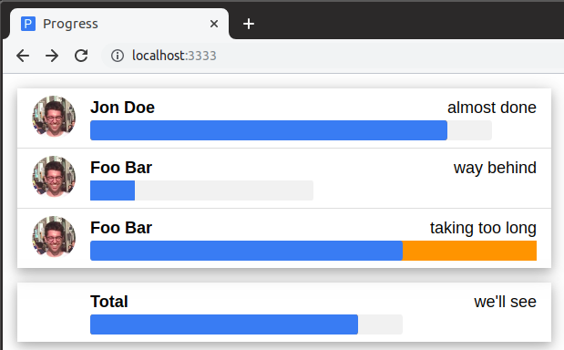

# progress

Display animated progress bars with a VERY simple Node.js backend and Vue.js + W3.CSS frontend.



## setup

```bash
npm install
```

## run

```bash
npm run start
```

open http://localhost:3333/

## docker

### build

```bash
docker build -t progress .
```

### run

```bash
docker run --rm -it -p8080:3333 progress:latest
```

open http://localhost:8080/

